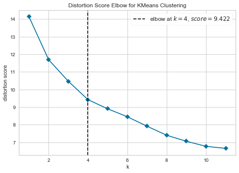
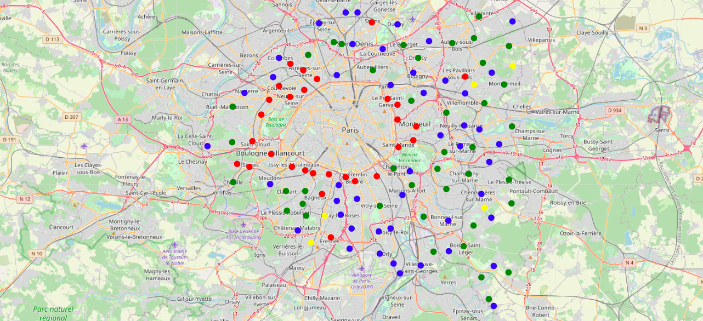
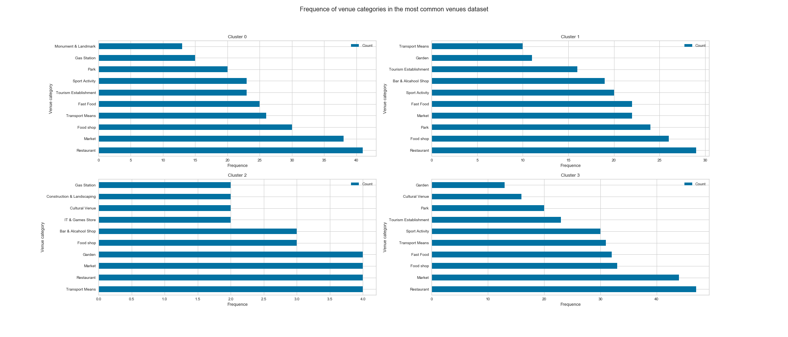
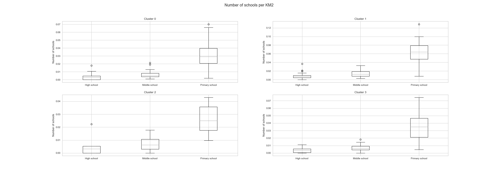
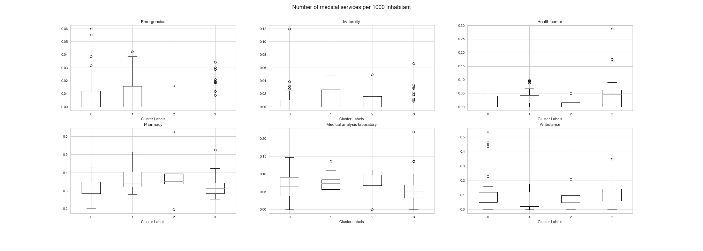

# Identifying the best suited cities in Ile-de-France for a Family
 **Fatima-Zahra KARKOURI** 
 Capstone Project 
 IBM Data Science Professional Certificate 
 
 ## 1.Introduction
 
 Ile-de-France is a French region grouping together eight departments including the capital of the country Paris. 
Producing 30% of the national GDP, Ile-de-France is the economic beating heart of the exagon, which explains why its population represents more than 18% of the total population of France.

The region counts more than 1268 municipalities, forming a disc around Paris and its 20 arrondissements. As the capital is saturated, people are looking to settle in a good town allowing them to have affordable housing, without impacting their quality of life and that of their family, especially with regard to essential commodities and leisure activities (hospitals, schools, parks, etc.).
Around Paris, a first circle of 3 departments forms what is called the *Petite Couronne* (Inner Ring). The municipalities of the latter benefit from an immediate proximity to Paris, and from being well served by transport, which makes them the preferred target of families seeking to settle in the Ile-de-France.

In this study, we will use the "K-means" algorithm to establish clusters of municipalities, in order to help families choose the best fit for their future projects.

## 2.Data

To conduct the study we will use two sources of data:

> **Foursquare API:** Which is an API that allows developers to get access to the Foursquare database of venue data and user content.In our case, we will be utilizing the API to retrieve the venues of each city. 
> **https://data.iledefrance.fr/:** The open data platform of the Île-de-France region,which we will use to get the geographical coordinates of the cities, the number of schools, and the health services per city.  

the first step in our retrieving and preprocessing data phase is to retrieve the geographical coordinates of the cities located in **Ile-de-France** region from the **data.iledefrance** internet site. The raw data is a CSV file containing the geographical position of the main towns of the region, coupled with administrative data. Such as :
    
> The **Department** or the code of the department of the city. 
> The **Code of the city**. Bouth the department and city codes refer to the INSEE code which is a numerical indexing code used by the French National Institute for Statistics and Economic Studies (INSEE) to identify various entities, including cities and departments. 
> The **Surface** is the city's area assessed in 1975 by the cadastre service of the Directorate General of Taxes.  
> The **Population** from the 1999 census, which we will discard in favor of a more recent one also retrieved from the **data.iledefrance** internet site and with the statistical reference date of January 1, 2014. 

As mention in the introduction the cities of the region form 2 circles around Paris: 
 
 - La Petite Couronne(Inner Ring): The departments bordering the capital: Hauts-de-Seine (92), Seine-Saint-Denis (93) and Val-de-Marne (94).
 - La Grande Couronne(Outer Ring): The departments in outskirts of Ile-de-France :Seine-et-Marne (77), Yvelines (78), Essonne (91) and Val-d'Oise (95).
 
In our study, we will focus only on the cities belonging to the **Petite Couronne** region, meaning we will select the cities with **Department** 92,93 and 94.

Second, we will use the **Foursquare API** to retrieve the list of venues within a 2000m range of the geographical coordinates of each city,and their respective categories and coordinates.
To do so we will be using the function *getNearbyVenues* which is based on the LAB **Segmenting and Clustering Neighborhoods in Toronto** from IBM Data Science Professional Certificate.

The big number of categories will not allow us to draw any meaningful conclusions from the resulting clusters , so we will regroup the similar categories in more general ones such as : **Transport Means** for Bus stations, Train stations, Tram stations and Metro stations.And **Resataurant** for all the different categories of restaurants. 

Once our data venues are cleaned we will use one-hot encoding to represent the final list of categories in numerical encoding, then compute the mean per city.

For any family who plans to have children or who already have children of school age, proximity to schools is a major criterion for choosing their home.We will consider this criterion by retrieving the list of schools from the **data.iledefrance** internet site.The data contains the features :
>The **School Name** 
>The **Nature** which we will use to recognise the level of the establishment(Primary, Middle or High School). 
>The **Code and name of the city** where it is located. 

We will use one-hot encoding to transform the values of the column **Nature** into seprate columns, then calcute the number of each level per city.But Since the cities are heterogeneous in terms of surfaces and populations the number of schools per city is not an equitable comparison. The number of schools per inhabitant may be raisonable however we don't have the capacity of each school hence our choice to work with the number of schools per square Km which may reflect the distance on average between houses and schools. 

Health services is one of the most important services that a familly requires in their neighborhood, we will incorporate this criterion by retrieving the dataset from **data.iledefrance** taht lists the health services at the municipal level in the Ile-de-France region.
It includes several health services but we will focus on: **Emergencies, Maternity, Health center, Pharmacy, Medical analysis laboratory** and **Ambulance**

We will compute the number of medical services per 1000 inhabitants for each city. Other than pharmacies the health services are generally centralized in hospitals hence we might have for example only one emergency service per city and comparing it to the surface of the city will not make any sense. The collective capacities of each service are indeed more informative and significant than the number of services per inhabitant but in absence of the first, the latter will give us an idea regarding the disponibility of the service.

In addition to health services, and since they can liberally practice their profession, we will need several health professionals in each city. The data was retrieved from the **data.iledefrance** internet site and it is a directory of the health professionals in the region. In our analysis, we will be interested in the Profession label that we will translate to English using **Translator Google API** and select the specialities: Pediatrician, Midwife and General practitioner.

Finally ,we will merge the different datatsets in one dataset.

## 3.Methodology

In our study, we aim to identify cities that suit families. In absence of a target variable that will allow us to classify the cities as suited or not suited, we have to look into **unsupervised algorithms** that identify patterns in the cities. 
**K-means** clustering will allow us to partition the cities in K clusters, and based on the resulting clusters we will be able to identify each is more suited for a family. 

To identify the optimal number of clusters, we will use the **Elbow method** employing the Package **KElbowVisualizer** from **yellowbrick**.
The **Elbow Method** fitts K-means to the dataset using a range of values of K (K is the number of clusters), for each value of K the scoring metric is computed and plotted. The optimal K is the one placed on the elbow of the curve since adding another cluster will not improve the metric significantly. In our case, the metric used is the default metric used by **KElbowVisualizer**: **Distortion** which is the sum of the square distance between each point and its assigned centroid.

The resulting graph suggests that the optimal number of clusters is **4 clusters.** 
We will run the K-means algorithm using the recommended number of clusters.

## 4.Results

In this section, we will visualize the resulting clusters and analyze their features.

**Cluster 0:** Are marked with green circles. 
**Cluster 1:** Are marked with red circles. 
**Cluster 2:** Are marked with yellow circles. 
**Cluster 3:** Are marked with blue circles. 

**Cluster 0**: As for the other clusters, restaurants, markets, and food shops are well spread in the municipalities of the inner suburbs of Ile-de-France. This cluster offers a good transport offer, in addition to tourist locations, parks and monuments. The cities of this cluster can be a tourist destination for people visiting Ile de France. 
**Cluster 1**: In addition to the 3 most popular venues in the municipalities of Île-de-France, the cities of this cluster, compared to the others, include several parks as well as spaces for sports activities. This cluster seems ideal for families wanting to settle down for the medium or long term. 
**Cluster 2**: This cluster is the one that has the most specificity compared to the 3 others. The most common amenities there are means of transport. And it also contains It & game stores, bar & alcohol shops, and gardens, which makes the municipalities of this cluster the most lively municipalities of the small crown. 
**Cluster 3**: in addition to the 3 most popular venues, the cities of this cluster give importance to fast food and transport, as well as sporting activities. We can imagine that the municipalities of this cluster can house companies. 
 

In comparison, the cities in **cluster 1** are those with the largest number of schools in relation to their surface areas, this finding is consistent with the analysis made on the distribution of venues in the municipalities of the inner suburbs.
As only 25% of the cities of **cluster 1** have 0.035 primary schools per one $Km^2$ or less (i.e one school per 28.57 $Km^2$) and 75% have 0.065 primary schools per one $Km^2$ or less (i.e one school per 15.40 $Km^2$) on the opposite for the three other clusters more than 75% of their cities have less than 0.04 primary schools per one $Km^2$ or less (i.e one school per 25 $Km^2$).

From the emergency and maternity boxplots, we notice that more than 50% don't have these services we see also a lot of outliers. This may be because emergency and maternity services distribution is not done at the city level but at the department level, so we should exclude them from our analysis.
From the graph, despite a slight advantage of **cluster 2**, we can see that the distribution of pharmacies and medical analysis laboratories are similar for the clusters.
The distribution of ambulances is balanced between the 3 clusters. We can deduce that although hospitals and emergency services are centralized in some municipalities, ambulances are distributed fairly to serve them.

From the box plot of the general practitioner the distribution is normal for each city with an interquartile region of a maximum 2 practitioner per 10000 inhabitants which imply that the cities of each cluster are very similar in term of general practitioner distribution. This boxplot also shows an advantage for **Cluster 2** with A median of 11 general practitioner per 10000 inhabitants whereas the **Clusters 0 and 1** counts an Upper Quartile of approximatly 7 per 10000 inhabitants.  

From the pediatricians' boxplot, we find that a large number of cities in **Cluster 0 and 3** have no pediatrician. **Cluster 2** has the highest number with a median of 0.15 pediatrician per 1000 inhabitants (1 pediatrician for all 6666 inhabitants).

The distribution of midwives follows the same logic as those of hospitals, in fact, this service is not generalized within the municipalities, but rather centralized taking advantage of the fact that the municipalities are adjacent to each other.

## 5.Discussion

Based on the various analyzes, we found that all the cities in the inner suburbs of Paris give an important place to restaurants, markets, food markets, and pharmacies. The availability of transport is also common in these municipalities. 
Concerning the medical service, the offer varies according to the service: certain services are centralized in certain municipalities, such as the emergency services, midwives, and pediatrics. On the other hand, other services are present in a fairly equitable manner in all the municipalities, notably pharmacies and the ambulance.
The choice of the city in which a person wants to settle will therefore focus mainly on other criteria, notably, the presence of gardens, parks, and sports activities, and the availability of schools. 
Based on the resulting clusters, the **Cluster 1** seems more suited for a Family with or planning to have children, as it has a large number of parks, gardens, and sport activities spaces. These municipalities also benefit from more schools compared to others. 
**Cluster 2** is distinguished from the other 3 by the presence of places of entertainment, these municipalities can be ideal for young people seeking an active life in their place of residence. 
Compared to other clusters, **Cluster 3** is the one with the best transport and fast food offerings, these two elements are characteristic of cities hosting a large number of companies, and consequently receiving a large number of employees every day. 
**Cluster 0** is the one with the largest number of tourist sites, it also has a significant transport offer. these towns can therefore be the target of tourists visiting the French capital. 

It should be noted that these cities are the most coveted by people wanting to settle around the French capital, so it is quite normal that the main facilities are available in all the municipalities.
To carry out this work, we used data from French official bodies, however, we were forced not to go too deep in our analysis because we did not have a certain level of detail, for example: speaking of hospitals, it would have been more judicious if we had the number of beds per hospital. Concerning schools, the number of classes and their capacity would have influenced our analyzes.

## 6.Conclusion

This study allowed us to have an idea about the categorization of the cities of this region, but, to have more convincing and more reliable results, it is necessary to take into consideration the future development plans of these cities and the demographic predictions. 
Choosing a city in which to settle is sometimes more complicated, choosing the district is even more so. Sometimes, all it takes is for a TGV or train line to pass behind a residential complex for it to lose a lot of its value. and in the opposite, the creation of a new metro stop or train station can transform the life and potential of a municipality. 
The number, quality, and precision of the data will allow the full potential of machine learning algorithms to be exploited, and by doing this work, I understand that, beyond the technical and coding aspects, knowledge and research in the field to be studied are necessary to carry out a study.

